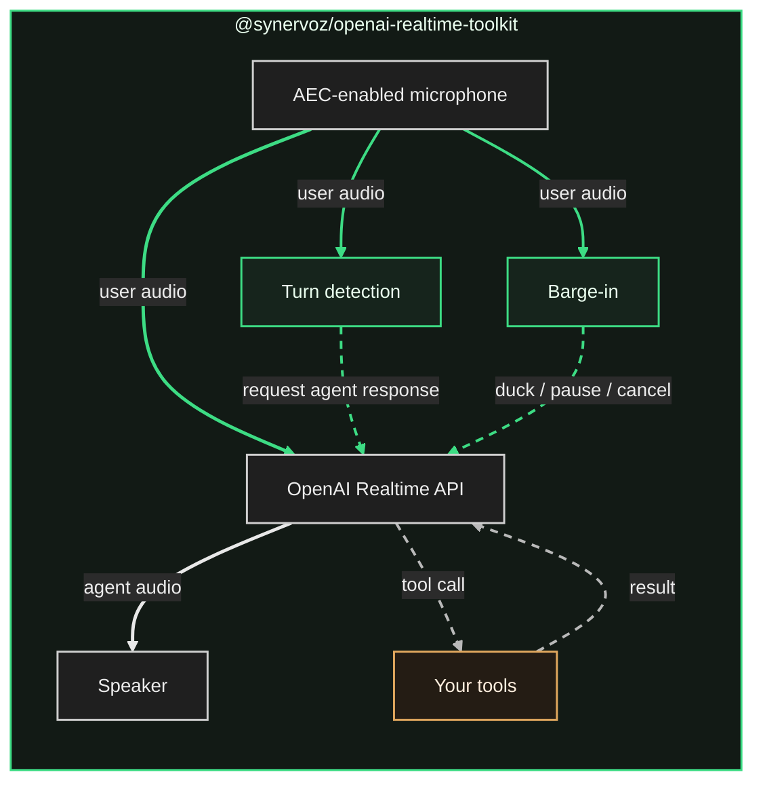

# Voice agents in React Native

A voice agent is something your users speak to, that answers in speech, and that can reach into your app and act while it is talking, like booking an appointment or changing the screen. The conversation is the interface, and the tool calls it makes are what turn talk into action.

`@synervoz/openai-realtime-toolkit` is the layer that makes this work on a phone. You get one provider and two hooks. Underneath, it owns the microphone and speaker, holds the Realtime session, and switches on each platform's echo cancellation. It runs voice-activity detection and a semantic turn model on the device so that turn-taking holds up in a noisy room. It sequences barge-in so interruptions land right away, and it routes tool calls into your own functions.

| Platform | Status    |
| -------- | --------- |
| iOS      | Supported |
| Android  | Supported |

```sh
npm install @synervoz/openai-realtime-toolkit
```

## What the API leaves out

OpenAI's Realtime API made the agent itself easy. Speech goes up, speech comes back, the model handles what happens in between and calls your functions along the way. What it hands you is an audio stream. Turning that stream into something people can hold a conversation with is the work that sits around it:

- **Capture and playback.** Pulling audio off the microphone and pushing the reply out to the speaker, at matching sample rates, through the right audio route.
- **The connection underneath.** Opening and holding a WebSocket session, streaming captured audio up in buffers, playing back what streams down, and recovering when it drops.
- **The microphone hearing the speaker.** On speakerphone the agent picks up its own voice and starts answering itself, until acoustic echo cancellation subtracts it back out.
- **Knowing when a turn ended.** Telling a finished sentence apart from a pause in the middle of one.
- **Getting out of the way.** Going quiet the instant someone talks over the agent, rather than a couple of seconds later.

None of that ships with the API. It is all native work, and it is where voice projects stall. This toolkit is that layer. You pick a preset that matches the environment, and it handles the rest.

## The easy part

Wrap your app, call the hook, register a tool, press the button.

```tsx
import {
  OpenAIRealtimeToolkitProvider,
  useOpenAIRealtimeToolkit,
  useTool,
} from '@synervoz/openai-realtime-toolkit'

export default function App() {
  return (
    <OpenAIRealtimeToolkitProvider instructions="You are a terse, friendly voice assistant.">
      <Screen />
    </OpenAIRealtimeToolkitProvider>
  )
}

function Screen() {
  const { isRunning, start, stop } = useOpenAIRealtimeToolkit()

  // Something the agent can actually do. Ask it the time.
  useTool({
    name: 'get_time',
    description: 'Get the current time.',
    handler: async () => ({ time: new Date().toLocaleTimeString() }),
  })

  return (
    <TouchableOpacity onPress={isRunning ? stop : start}>
      <Text>{isRunning ? 'Stop' : 'Start talking'}</Text>
    </TouchableOpacity>
  )
}
```

That is a working voice agent, tool call included. `start()` requests the microphone and builds the audio graph, wiring the microphone to OpenAI Realtime to the speaker with echo cancellation already on. `useTool` puts a function in the model's hands, and its return value goes back automatically. There are no credentials in the snippet either, so it runs on shared defaults until you swap in your own.

Ten minutes in, at your desk, it feels finished.

## Meeting the real world

Every use case wants different tuning, because the environment differs and so does how much interruption people will put up with. You usually discover that through the same handful of complaints:

- **It cuts you off mid-sentence.** You pause to think, "so what I'm looking for is, uh," and the agent treats the pause as its cue and answers a question you had not finished asking.
- **It answers things you never said.** In a café, someone at the next table laughs or the espresso machine goes off, and the agent starts talking.
- **It talks over you.** You try to interrupt a long, wrong answer, and it keeps going for another second or two before it notices.

These are not defects in the model. They come back to the one piece the API leaves out: turn detection. Out of the box, OpenAI makes that call on its own servers, a step removed from the microphone, and gives you one setting to adjust. Move that decision onto the phone and it becomes instant, and tunable for the room your users are actually in. One flag turns it on:

```tsx
const { localTurnHandling } = useOpenAIRealtimeToolkit()
localTurnHandling.setEnabled(true)
```

Now turn detection runs locally. It works in two stages, with a separate fast path for interruptions.

- **Stage 1 asks whether anyone is speaking.** Voice-activity detection runs on the device, so the answer is immediate. Sound above your threshold counts as speech, and the threshold is yours, so the conversation at the next table can stop registering as speech at all.
- **Stage 2 asks whether they finished.** A semantic model scores what you said from 0 to 1 for how complete a thought it is. "What's the weather in" scores low. "What's the weather in Berlin" scores high. Same pause, different meaning.
- **Barge-in is the fast path.** The moment stage 1 hears you start, the agent's in-flight reply ducks in volume, then pauses, and can cancel outright, each on a clock you set. Ducking first is what makes an interruption feel natural, since the agent goes quiet before it goes silent, the way a person trails off when you start talking.



In the diagram, solid lines carry audio and dashed lines carry the on-device decisions and the tool traffic. The two green boxes are where those on-device decisions happen. Switch local turn handling off and both boxes are simply absent, and OpenAI makes the calls at the far end of the audio stream instead. The amber box on the right is your tools. Everything else belongs to the toolkit.

The knobs behind all this exist because rooms differ, and you rarely need to touch them directly. There are three presets, and choosing one is a single line. Most apps stop there:

```tsx
import { NOISY_CONFIG } from '@synervoz/openai-realtime-toolkit'

localTurnHandling.setConfig(NOISY_CONFIG)   // QUIET_CONFIG, BALANCED_CONFIG, NOISY_CONFIG
```

`QUIET_CONFIG` suits a phone held to your face, `NOISY_CONFIG` handles a café or speakerphone, and `BALANCED_CONFIG` sits between them as the default. Preset changes take effect on the live session, so a switcher in your own settings screen works. When a preset is not enough, you tune by symptom, one knob at a time. See [Turn detection](docs/turn-detection.md) for how the presets differ and the full knob reference.

## Tools

`useTool` from the quickstart scales up to anything your app can do. It takes typed arguments and can mutate state or call your backend. Register a `set_background_color` tool and "make the background dark blue" repaints the screen while the agent talks. See [Tools](docs/tools.md) for the full example, dynamic tool sets, and what happens when a handler throws.

## Documentation

- [Getting started](docs/getting-started.md) covers install, iOS, Android, Expo, credentials, and App Store privacy.
- [Turn detection](docs/turn-detection.md) covers the two stages and barge-in in depth, the three presets, tuning by symptom, the full knob reference, and what false turns actually cost.
- [Tools](docs/tools.md) covers `useTool`, dynamic tool sets, and tool-error handling.
- [API reference](docs/api-reference.md) covers the provider, the `useOpenAIRealtimeToolkit()` hook, lifecycle, runtime settings, every export, and the error codes.
- [Example app](example/README.md) is a complete RN app with turn detection, presets, and a tool call.

```sh
npm install @synervoz/openai-realtime-toolkit
```
